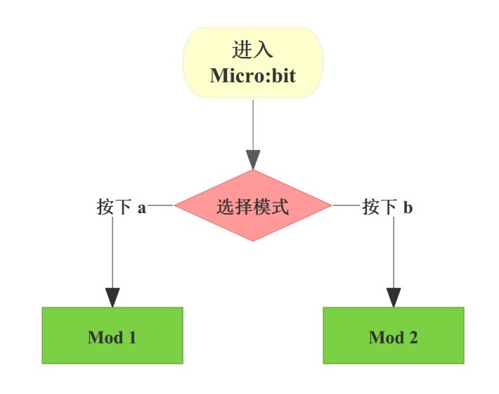
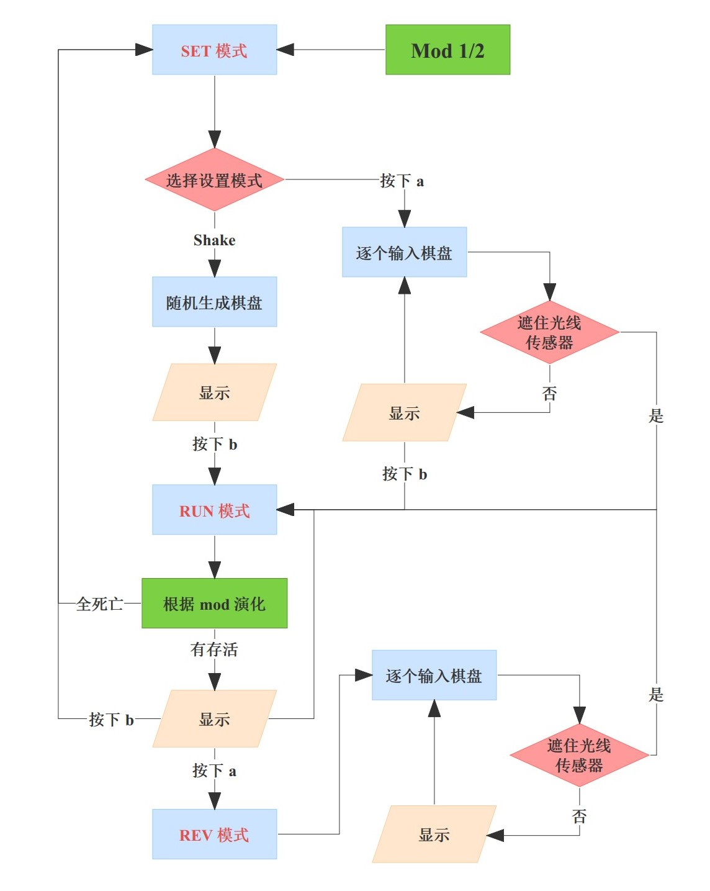
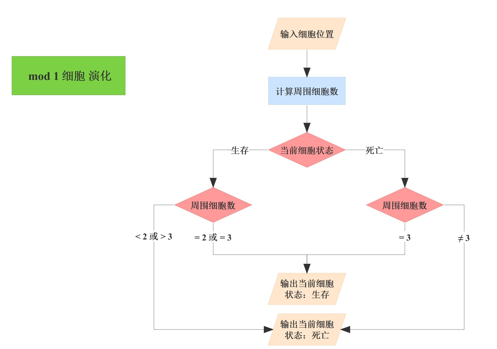
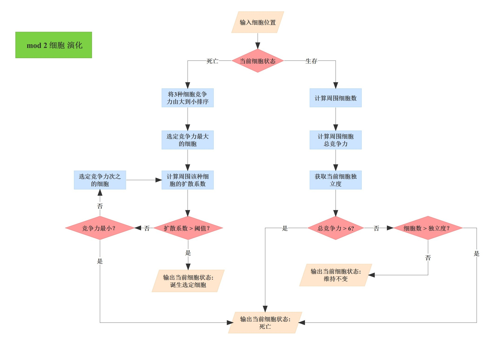
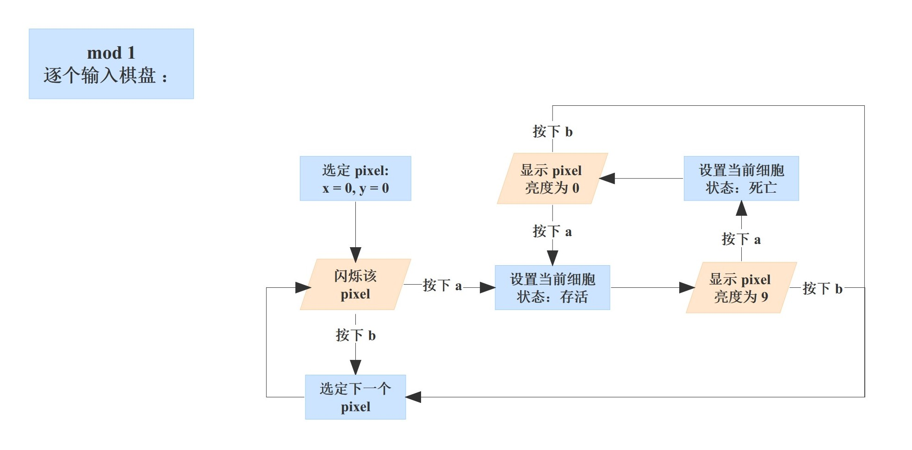
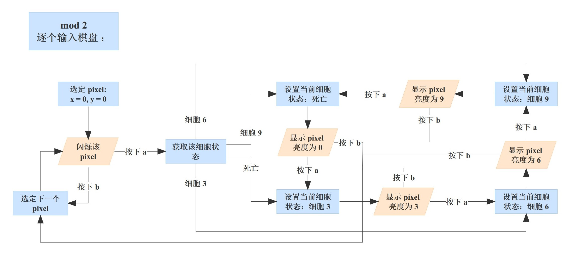

# Game-of-Life-Pro-Plus-Max

- 数据结构与算法B python版 陈斌班 C1作业 Micro:bit项目 生命游戏进阶

- 将源代码拷贝至 [`Micro:bit` 官方网站](https://python.microbit.org/v/3) 即可运行

- 游戏演示视频：[C128-生命游戏进阶_哔哩哔哩_bilibili](https://www.bilibili.com/video/BV1DV4y127Tm/?spm_id_from=333.999.0.0)

## 项目介绍

* `Game Simple.py` 为简单模式（`mod 1` ，即**传统康威生命游戏**）
* `Game Complex.py` 为进阶模式（`mod 2` ，即**进阶康威生命游戏**）

> 包含了多种系数（竞争力，扩散系数，独立度）的全新生命游戏

* `Game of Life.py` 为集成了两种模式的版本
* `Report.pdf` 为项目报告

## 游戏方法

- **开始**：选择模式

- **总体运行模式**

- `mod 1` 简单模式的**细胞演化**

- `mod 2` 进阶模式的**细胞演化**

- `mod 1` 简单模式的**棋盘输入**

- `mod 2` 进阶模式的**棋盘输入**

